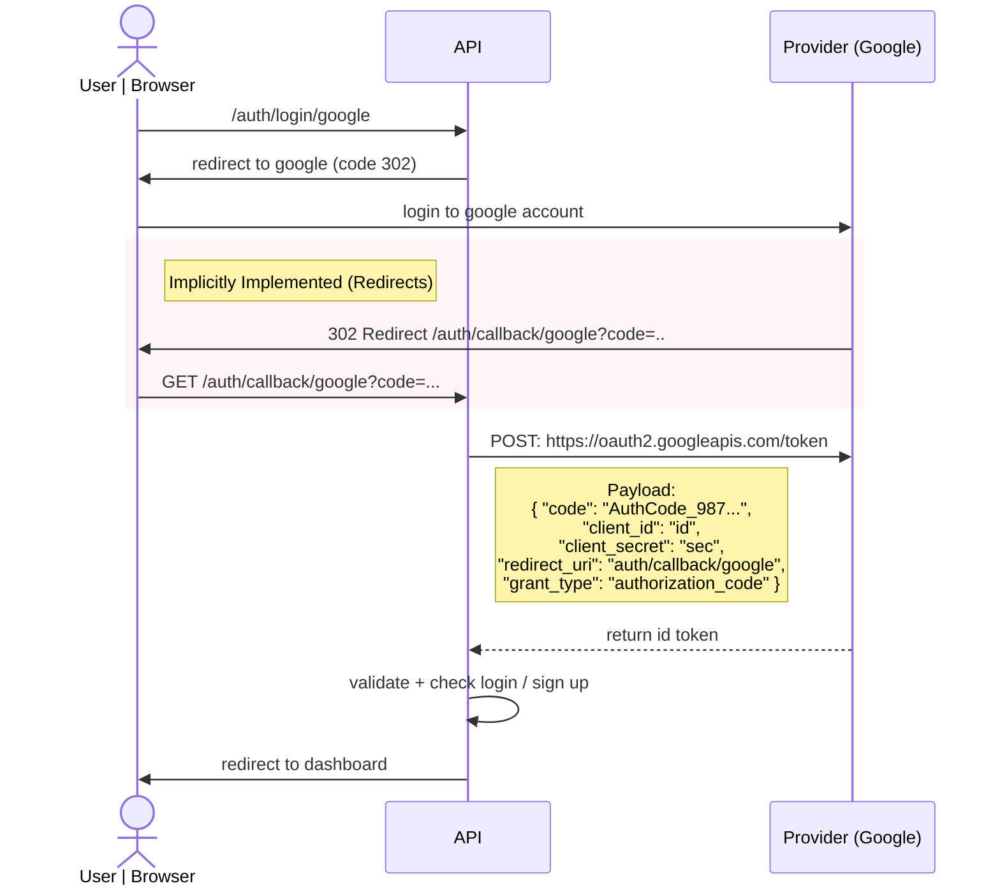
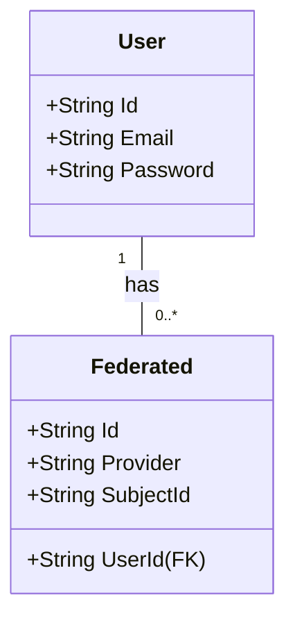

# Google OAuth Implementation

This document outlines the authentication flow, data model, and security requirements for the Google OAuth integration.

## 1. Authentication Sequence

The following diagram illustrates the interaction between the User, our API, and the Google Provider.

**Note:** The highlighted section indicates steps implicitly handled by the browser/redirects.



## 2. Data Model

The schema separates the core `User` identity from the `Federated` identity provider details.



## 3. Security Configuration

### RSA Key Generation
Use the following OpenSSL commands to generate the key pair required for signing and validating JWTs.

```bash
# 1. Generate the private key (2048 bits)
openssl genrsa -out private.pem 2048

# 2. Extract the public key from the private key
openssl rsa -in private.pem -pubout -out public.pem
```
